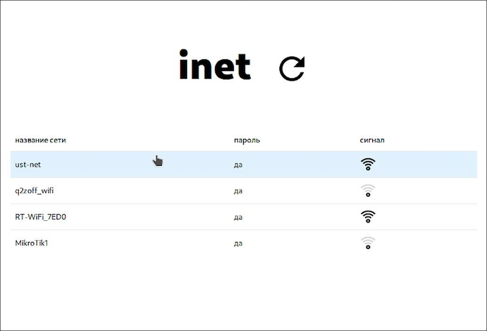

# inet
 
## установка
1. Установите зависимости ([iwd](https://wiki.archlinux.org/title/Iwd_(%D0%A0%D1%83%D1%81%D1%81%D0%BA%D0%B8%D0%B9))):
```bash
sudo pacman -S iwd # Arch based
sudo apt install iwd # Debian based
sudo dnf install iwd # Fedora based
```
Если вы используете NixOS, то нужно добавить следующую строку в /etc/nixos/configuration.nix (подробнее [тут](https://nixos.wiki/wiki/Iwd)):
```nix
networking.wireless.iwd.enable = true;
```
2. Запустите службу `iwd.service`:
```bash
systemctl start iwd.service # на NixOS эту команду писать не нужно
```
3. Установите саму программу в релизах.
## сборка из исходного кода
Для сборки из исходного кода на системе должны быть установлены `Nodejs, npm, cargo, Rust`.
1. Склонируйте репозиторий:
```bash
git clone https://github.com/UstuzhaninKonstantin/inet
cd inet/gui
```
2. Установите `Tauri CLI`:
```bash
npm install --save-dev @tauri-apps/cli
 ```
 3. Установите [зависимости](https://tauri.app/v1/guides/getting-started/prerequisites/#setting-up-linux) `Tauri` 
 4. Соберите приложение:
```bash
npm run tauri build
```

